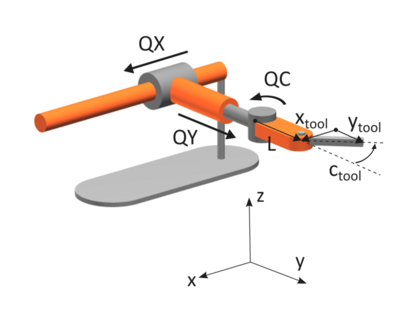
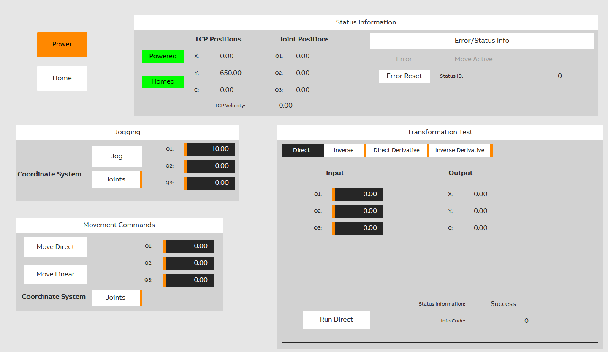

# Custom Kinematics Sample Project

This is a sample project that showcases an implementation of a custom kinematics defined the Automation Studio Help UseCases section under MpMotion.

## Features:
- Implementation of the library sample provided from the AS Help
- Implementation of the core library functions to be able to use the transformations
- Implementation of the MpMotion configuration objects to run the robot
- Simplified Scene Viewer Scene to help visualize the robot
- Basic testing task and interface for manually testing the transformations
- Simple MpView visualization
    - Issue basic robot movement commands
    - Issue basic jogging commands
    - Visualize output TCP/Joint positions
    - Manual test calls for transformation functions
- Basic UnitTesting implementation to help aid in development

## Usage

1. Download the project and any needed installers from the br-automation website or Tools->Upgrades
2. Compile and create an offline instalation for the project
3. Open SceneViewer Scene
    `Project\CustomKinematics\Scene\Custom3AxisScene.scn`
4. Once ArSim has started, connect in SceneViewer via Online->OPC UA -> Connect and select the local running ArSim version.
5. Open browser window and navigate to 
    `127.0.0.1:81`
6. Power and Home the robot, from there you can issue movement commands to see the SceneViewer

### Notes:
This is a sample project and is intended as demonstration purpose for ArSim usage primarily.
A change of the dimension from the help use case was made for the dimension to be 650 units instead of 65 for visualization in Scene Viewer only. Any dimension can be chosen instead if the scene is updated appropriately.

#### Versions:  
Developed with the following versions:
- AS 4.12.4.107
- AR: H4.93
- MpMotion: 5.24.1
- MpCockpit: 5.24.1
- MpView: 5.24.0